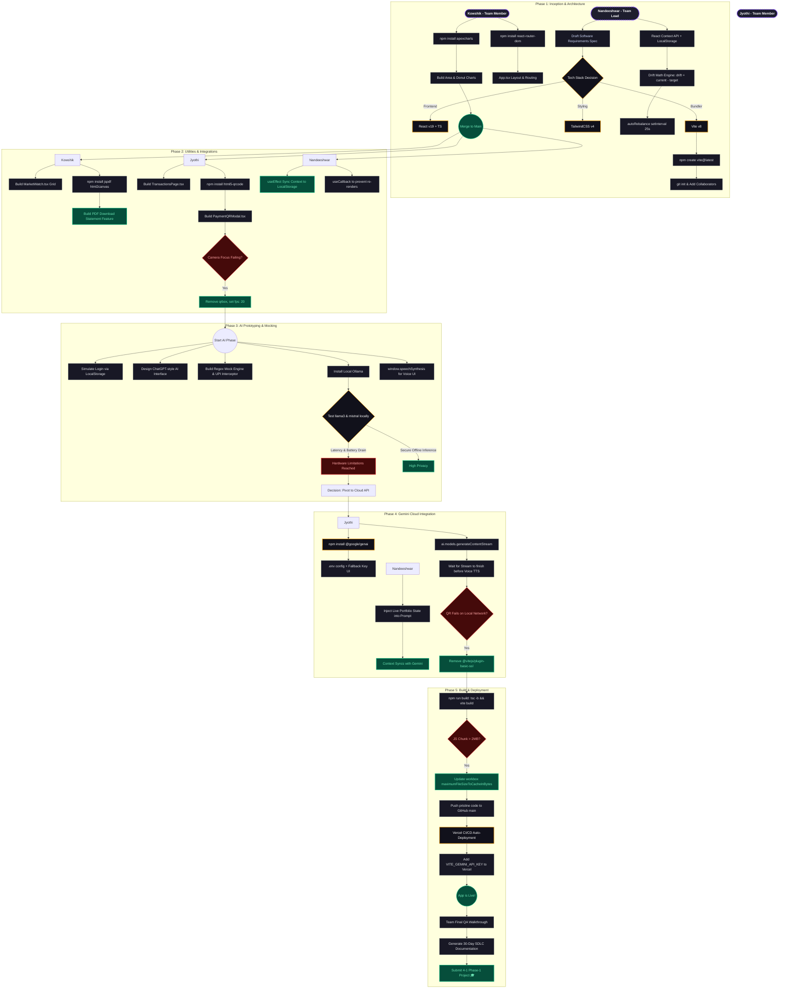

# WealthOS Pro – Highly Detailed SDLC Flowchart

This diagram visualizes the granular actions, technical decisions, and team interactions across all 5 phases of the 4-1 Major Project development lifecycle.

