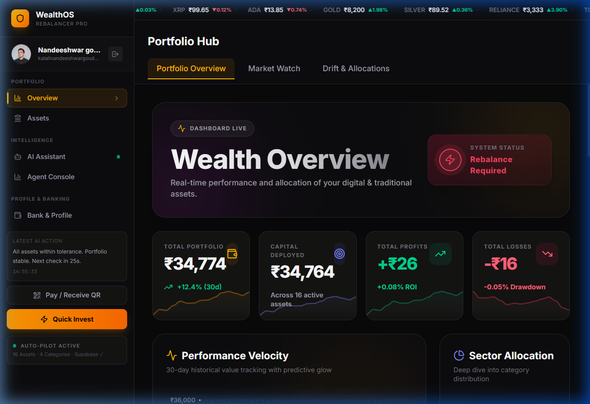
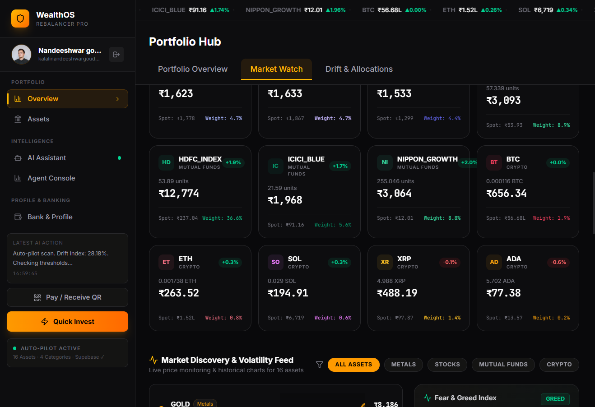
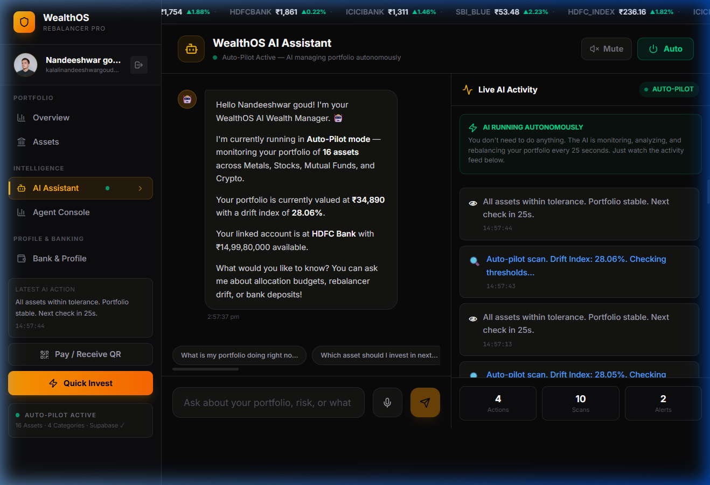
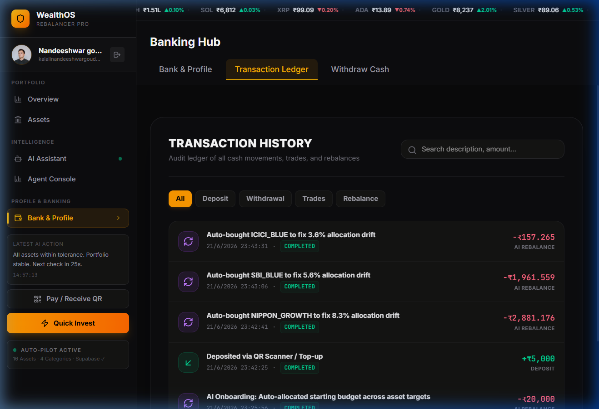

# WealthOS Pro – Module Screenshots

Here are the high-resolution screenshots of the 4 core modules captured directly from the live application running on your local machine. You can use these for your Major Project presentation and documentation.

## 1. Dashboard (Core Architecture & State Module)

## 2. Market Watch (Data Visualization Module)

## 3. AI Assistant (Gemini & Voice Integration Module)

## 4. Transactions (Payment & Authentication Module)

---
*Note: The images above were captured automatically by the browser testing agent traversing the live React application.*
