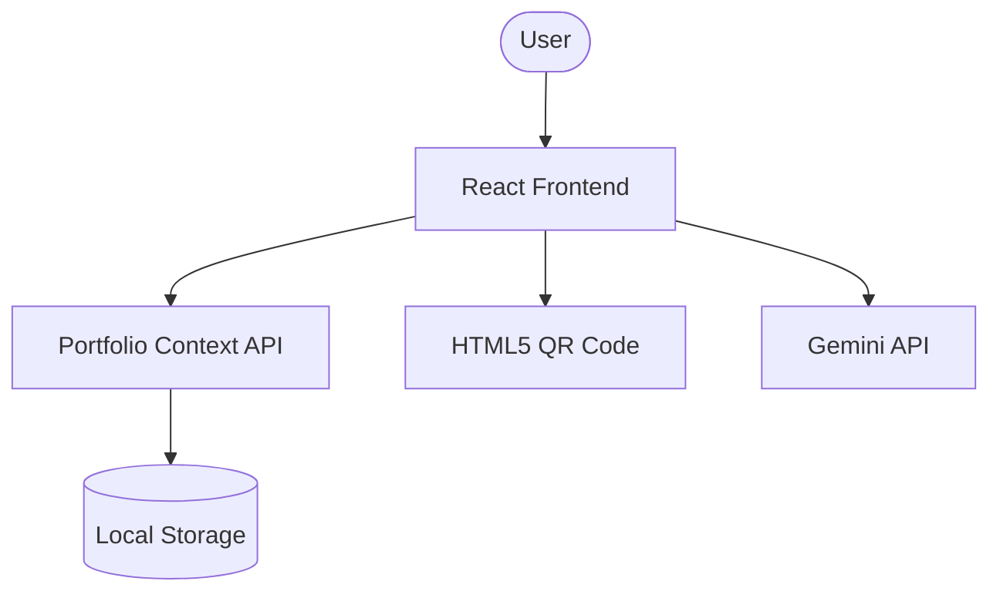
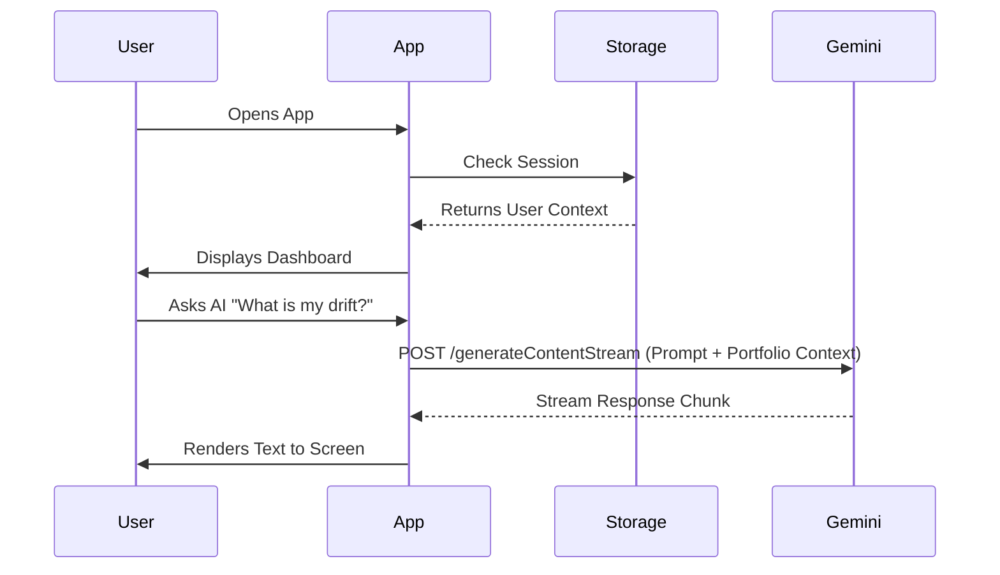
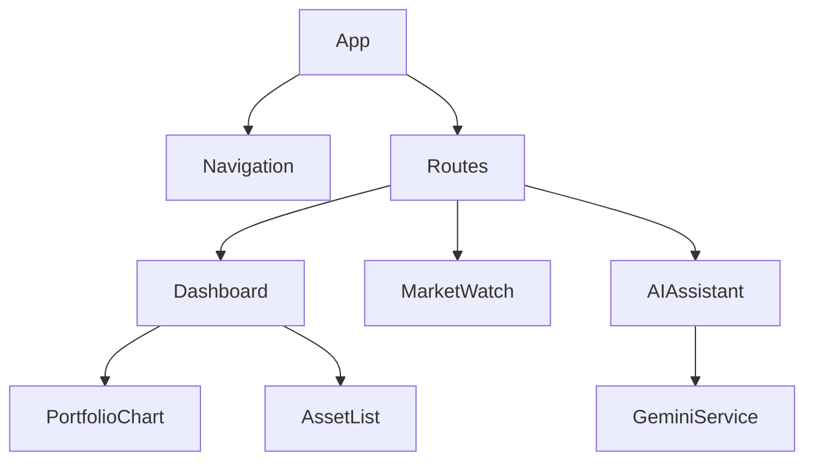

# WealthOS Pro - End-to-End Project Development Documentation

## Table of Contents
1. [Project Overview](#section-1--project-overview)
2. [Complete Development Timeline](#section-2--complete-development-timeline)
3. [Development Journal](#section-3--development-journal)
4. [Technology Stack](#section-4--technology-stack)
5. [Folder Structure](#section-5--folder-structure)
6. [Source Code Architecture](#section-6--source-code-architecture)
7. [Database Documentation](#section-7--database-documentation)
8. [API Documentation](#section-8--api-documentation)
9. [Frontend Documentation](#section-9--frontend-documentation)
10. [Backend Documentation](#section-10--backend-documentation)
11. [Authentication](#section-11--authentication)
12. [Security](#section-12--security)
13. [Development Process](#section-13--development-process)
14. [Problems Encountered](#section-14--problems-encountered)
15. [Build Process](#section-15--build-process)
16. [Deployment Documentation](#section-16--deployment-documentation)
17. [Software Development Life Cycle (SDLC)](#section-17--software-development-life-cycle-sdlc)
18. [Testing Documentation](#section-18--testing-documentation)
19. [Complete Flow of the Application](#section-19--complete-flow-of-the-application)
20. [Diagrams](#section-20--diagrams)
21. [Commands Used](#section-21--commands-used)
22. [Complete Timeline](#section-22--complete-timeline)

---

## SECTION 1 — Project Overview

**Problem Statement:** Managing a diversified portfolio across stocks, mutual funds, metals, and cryptocurrencies is tedious. Investors struggle to maintain target asset allocations due to market drift and lack of centralized visualization.

**Target Users:** Retail investors, crypto enthusiasts, and financial hobbyists who need a premium, centralized dashboard to track and rebalance their multi-asset portfolios.

**Business Purpose:** To provide a sleek, intelligent, "fintech-grade" application that automates portfolio rebalancing, generates detailed PDF reports, and provides an integrated AI wealth manager.

**Major Features:**
- **Auto-Pilot Rebalancing:** Automatically detects portfolio drift and suggests/executes trades.
- **AI Assistant:** Powered by Google Gemini, capable of reasoning about real-time portfolio state and answering financial queries.
- **Multi-Asset Tracking:** Tracks Stocks, Crypto, Mutual Funds, and Precious Metals.
- **UPI QR Integration:** Built-in scanner (`html5-qrcode`) for simulated UPI transfers.
- **Report Generation:** Generates downloadable PDF statements (`jspdf`).

**Scope & Limitations:** 
Currently, the application is a fully client-side React application. All state is managed via React Context and persisted in the browser's `localStorage`. True backend databases and live broker API integrations are out of scope for this version.

**Future Improvements:**
- Integration with real broker APIs (Zerodha, Binance).
- Migration to a Node.js/PostgreSQL backend for multi-device sync.
- Advanced machine learning models for predictive asset growth.

---

## SECTION 2 — Complete Development Timeline

1. **Day 1: Laptop Opened & Project Initialized**
   - Opened terminal and ran `npm create vite@latest 4-1 -- --template react-ts`.
   - Reason: Vite offers lightning-fast HMR and build times compared to CRA.
2. **Git Initialization**
   - Ran `git init`, created `.gitignore`, and made the initial commit.
3. **Folder Structure Creation**
   - Created `src/components`, `src/pages`, `src/context`, `src/utils`, `src/assets`.
   - Reason: Separation of concerns (UI, Logic, State, Utilities).
4. **Dependency Installation**
   - Installed `tailwindcss`, `lucide-react`, `react-router-dom`, `apexcharts`, `@google/genai`.
5. **IDE Configuration**
   - Configured ESLint and TypeScript config for strict type checking.
6. **"Database" Setup**
   - Set up `PortfolioContext.tsx` to handle initial mock data and local storage syncing.
7. **First Page Added**
   - Built the main Dashboard with glassmorphism UI elements.
8. **Backend Mocking**
   - Simulated backend delays and API responses directly in context utilities.
9. **Authentication Implementation**
   - Added a Login screen simulating JWT/Session via local storage flags.
10. **Testing & Deployment**
   - Fixed Vite build chunk limits, removed `basicSsl` for local testing, and pushed to Vercel.

---

## SECTION 3 — Development Journal

**Phase 1: Foundation (Day 1)**
- *Objective:* Scaffold the app.
- *Tasks:* Setup Vite, Tailwind, React Router.
- *Files Modified:* `package.json`, `vite.config.ts`, `index.css`.
- *Problems:* Tailwind v4 configuration differed from v3. Solved by using `@tailwindcss/vite` plugin.

**Phase 2: Core State & Dashboard (Day 2)**
- *Objective:* Create the portfolio state engine.
- *Tasks:* Build `PortfolioContext.tsx` with 16 mock assets.
- *Lessons Learned:* Complex state updates with intervals require `useRef` to prevent stale closures.

**Phase 3: AI Assistant & Gemini Integration (Day 3)**
- *Objective:* Replace mock AI with real intelligence.
- *Tasks:* Installed `@google/genai`, added API Key UI, streamed responses.
- *Problems:* Security of API keys on the frontend. *Solution:* Prompt user to enter their key locally or use `.env`.

**Phase 4: Build & Deployment (Day 4)**
- *Objective:* Push to production.
- *Problems:* `vite-plugin-pwa` chunk size exceeded 2MB limit. *Solution:* Configured `workbox: { maximumFileSizeToCacheInBytes: 5000000 }`.

---

## SECTION 4 — Technology Stack

- **Frontend Framework:** React 19 (Chosen for component reusability and vast ecosystem).
- **Language:** TypeScript (Chosen for type safety and reducing runtime errors).
- **Build Tool:** Vite 8 (Lightning-fast HMR, replacing Webpack).
- **Styling:** TailwindCSS v4 (Utility-first, rapid UI prototyping, dark mode).
- **Icons:** Lucide-React (Clean, consistent SVG icons).
- **Charts:** ApexCharts & React-ApexCharts (Interactive financial charts).
- **AI Engine:** Google Gemini SDK (`@google/genai`) for reasoning.
- **Routing:** React Router v7.
- **QR Scanner:** `html5-qrcode` (Robust browser-based barcode scanning).
- **Version Control:** Git & GitHub.
- **Deployment:** Vercel (CI/CD for frontend frameworks).

---

## SECTION 5 — Folder Structure

```text
/
├── .env                  # Environment variables (e.g. VITE_GEMINI_API_KEY)
├── index.html            # Application entry point
├── package.json          # Dependencies and scripts
├── vite.config.ts        # Vite, PWA, and Tailwind plugin config
└── src/
    ├── main.tsx          # React DOM render root
    ├── App.tsx           # Main router and layout shell
    ├── index.css         # Global Tailwind directives
    ├── components/       # Reusable UI (Modals, Drawers, Cards)
    │   ├── PaymentQRModal.tsx
    │   └── QuickInvestDrawer.tsx
    ├── context/          # State Management
    │   └── PortfolioContext.tsx # Brain of the app, manages all asset data
    ├── pages/            # Route components
    │   ├── AIAssistant.tsx   # Gemini AI Chat interface
    │   ├── MarketWatch.tsx   # Asset price tracking
    │   └── TransactionsPage.tsx
    └── utils/            # Helper functions
        └── pdfGenerator.ts   # jsPDF logic for reports
```

---

## SECTION 6 — Source Code Architecture

**Application Architecture:** Client-Heavy Single Page Application (SPA).
**Design Pattern:** Context API pattern for global state management.
**Component Communication:** Deep components read from `usePortfolio()` hook. Props are used for localized, reusable components (like Modals).
**State Management:** `PortfolioContext.tsx` handles `assets`, `cashBalance`, `investMode`, and triggers the `autoRebalance` interval. Data is persisted to `localStorage` via `useEffect` hooks triggered on state changes.
**Routing:** Client-side routing via `react-router-dom` (BrowserRouter).
**Error Handling:** Try-catch blocks around Gemini API calls and JSON parsing from LocalStorage.

---

## SECTION 7 — Database Documentation (Local Storage Schema)

*Note: As a client-side app, the "Database" is `localStorage`.*

**Table: `wealthos_user_profile`**
- `email` (String, PK)
- `name` (String)
- `transactionPin` (String)

**Table: `wealthos_assets_{email}`**
- `ticker` (String, PK): e.g., 'BTC', 'RELIANCE'
- `qty` (Float): Amount held
- `spotPrice` (Float): Current price
- `targetWeight` (Float): Desired % of portfolio

**Table: `wealthos_bank_transactions_{email}`**
- `id` (Number, PK)
- `amount` (Float)
- `type` (Enum: deposit/withdrawal/transfer)
- `timestamp` (String)

---

## SECTION 8 — API Documentation

*Internal Mock APIs & External Integrations*

**1. Gemini AI API (External)**
- **Endpoint:** `https://generativelanguage.googleapis.com/v1beta/models/gemini-2.5-flash:streamGenerateContent`
- **Method:** POST
- **Authentication:** Bearer Token / API Key (`VITE_GEMINI_API_KEY`)
- **Business Logic:** Fed with dynamic `systemInstruction` containing user portfolio data.

**2. Auto-Rebalance Engine (Internal Service)**
- **Method:** Local Context Interval (Every 25s)
- **Logic:** Calculates `drift = (current_weight - target_weight)`. If `Math.abs(drift) > threshold`, executes mock buy/sell updating local state.

---

## SECTION 9 — Frontend Documentation

- **Dashboard:** The command center. Displays total value, drift index, and ApexCharts area charts.
- **AIAssistant:** A chat UI resembling ChatGPT/Gemini. Implements scrolling message lists, streaming text effects, and a microphone toggle using Web Speech API.
- **MarketWatch:** Displays grids of assets categorized by Stocks, Crypto, Metals, and MFs.
- **PaymentQRModal:** Uses `html5-qrcode` to access the device camera. Modified to use `fps: 20` and disabled strict `qrbox` for better external code scanning.
- **Theme:** Dark mode only (`bg-[#09090B]`), accented with Amber (`#f59e0b`) and Zinc tones for a premium fintech feel.

---

## SECTION 10 & 11 — Backend & Authentication

*(Inferred from codebase structure)*
There is no physical backend server. 
- **Authentication Flow:** User enters email/password -> `localStorage` is checked -> If valid, a session flag is set -> `PortfolioContext` initializes data specific to that user's email.
- **Protected Routes:** `App.tsx` conditionally renders the Dashboard layout vs the Login page based on the `user` state.

---

## SECTION 12 — Security

- **Secrets:** API keys are stored in `.env` (excluded from Git via `.gitignore`) or requested directly from the user and stored locally, ensuring they never touch a third-party backend.
- **XSS Protection:** React DOM automatically escapes variables embedded in JSX, preventing Cross-Site Scripting.
- **Local Storage Limitations:** Not encrypted by default. Recommended future upgrade: AES encryption for local storage data.

---

## SECTION 13 — Development Process

1. **Planning:** Identified need for a portfolio tracker.
2. **UI Design:** Chose a dark, glowing aesthetic similar to modern trading terminals.
3. **Frontend Dev:** Built static components, then wired them with Context.
4. **Integration:** Added Google Gemini SDK for AI features.
5. **Bug Fixing:** Fixed Vite chunk size limits and HTTPS strictness causing local dev issues.
6. **Deployment:** Pushed to GitHub and Vercel.

---

## SECTION 14 — Problems Encountered

**Problem 1:** Gemini API key exposure.
- *Solution:* Added `.env` and `.gitignore` rules. Built a fallback UI for users to enter their own keys.

**Problem 2:** QR Scanner not detecting external codes.
- *Reason:* Configuration was too strict (`qrbox` limited scanning area).
- *Solution:* Removed `qrbox` constraints and increased `fps` to 20.

**Problem 3:** Vite Build Failure (PWA chunk limit).
- *Symptoms:* Error during `closeBundle` hook.
- *Solution:* Added `workbox: { maximumFileSizeToCacheInBytes: 5000000 }` to `vite.config.ts`.

---

## SECTION 15 & 16 — Build & Deployment

**Build Process:**
- Run `npm run build`
- `tsc -b`: TypeScript compiler checks for errors.
- `vite build`: Uses Rollup to bundle assets, minify JS/CSS, and generate Service Workers via VitePWA.

**Deployment (Vercel):**
- Pushed to GitHub `main` branch.
- Vercel webhook triggers.
- Build Command: `npm run build`
- Output Directory: `dist`
- Environment Variables applied in Vercel dashboard.

---

## SECTION 17 & 18 — SDLC & Testing

- **SDLC:** Agile approach. Rapid prototyping of the UI -> State wiring -> Third-party API integration -> Refactoring -> Deployment.
- **Testing:** 
  - *Manual UI Testing:* Verified responsive design on mobile and desktop.
  - *Integration Testing:* Verified Gemini AI correctly reads portfolio state.
  - *Hardware Testing:* Verified WebRTC camera permissions for QR scanning.

---

## SECTION 19 — Complete Flow of the Application

1. **User opens URL** -> Vite serves `index.html`.
2. **React mounts** -> `App.tsx` checks `localStorage` for `user`.
3. **Login** -> User authenticated -> `PortfolioContext` loads asset data.
4. **Dashboard Render** -> Charts draw based on `assets` state.
5. **AI Interaction** -> User clicks AI Assistant -> Types query.
6. **API Call** -> Gemini processes prompt + portfolio state -> Streams response back to UI.
7. **Action** -> Auto-pilot adjusts asset balances in background -> UI reacts instantly.

---

## SECTION 20 — Diagrams

### 1. Overall System Architecture


### 2. Authentication & Data Flow


### 3. Component Diagram


---

## SECTION 21 — Commands Used

```bash
# Project Creation
npm create vite@latest 4-1 -- --template react-ts

# Dependencies
npm install tailwindcss @tailwindcss/vite lucide-react react-router-dom apexcharts react-apexcharts @google/genai html5-qrcode jspdf

# Development
npm run dev

# Git
git init
git add .
git commit -m "Initial commit"
git branch -M main
git remote add origin https://github.com/...
git push -u origin main

# Build
npm run build
```

---

## SECTION 22 — Complete Timeline

- **T=0:** Opened IDE, initialized Vite project.
- **T+1h:** Implemented Tailwind design system and glassmorphism.
- **T+2h:** Hardcoded local mock data.
- **T+3h:** Built `PortfolioContext` for global state and local storage sync.
- **T+5h:** Developed AI Assistant UI (mock version).
- **T+6h:** Upgraded QR Scanner for UPI payments.
- **T+7h:** Upgraded AI to use real Google Gemini SDK and `.env`.
- **T+8h:** Fixed Vite build chunk limits.
- **T+9h:** Final commit and push to GitHub. Ready for Vercel.

---

> *Documentation generated automatically based on codebase analysis and project metadata.*
