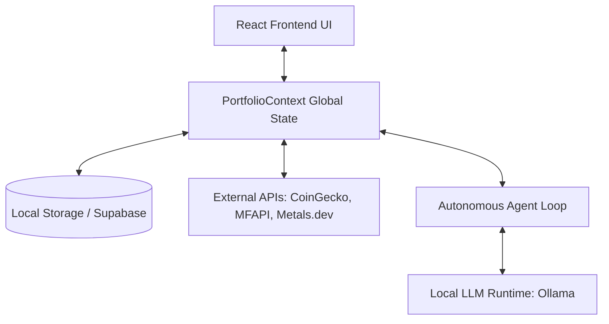

# WealthOS: System Architecture

This document details the architectural design of WealthOS, an autonomous AI-driven wealth management platform. The system is designed to provide real-time portfolio tracking, intelligent automated rebalancing, and transparent auditing.

---

## 1. High-Level Architecture

The system follows a modular client-heavy architecture, leveraging a React frontend for state management and an embedded AI agent loop, backed by external APIs for real-world data and local LLMs for decision making.

## 2. Core Components

### 2.1 The State Machine (PortfolioContext.tsx)
The central nervous system of WealthOS. It utilizes React's Context API to maintain a single source of truth for:
- User Profile and Bank Balances
- Live Asset Holdings and Target Weights
- The Activity Feed and Audit Ledger
- The calculated `driftIndex` (the absolute deviation of current weights vs target weights).

### 2.2 Live Data Aggregation
The app continuously polls real-world APIs to establish baseline prices:
- **Crypto:** CoinGecko API (`/simple/price`)
- **Mutual Funds:** MFAPI.in
- **Metals:** Metals.dev API
- **Currency:** ER-API for real-time USD to INR conversion.
*To simulate live trading environments, a random-walk volatility algorithm is applied locally on top of these baselines every 3 seconds.*

### 2.3 The Autonomous Agent Engine
A `useEffect` hook in the Context acts as the daemon process for the AI agent.
- **Trigger:** Runs every 25 seconds when `investMode === 'auto'`.
- **Evaluation:** Calculates the current portfolio drift.
- **Decision Matrix:** If `driftIndex > 0.4%`, it identifies the most under-allocated asset.
- **Execution:** Calculates the required capital to correct the drift, automatically drafts a "BUY" order, executes it against the local cash balance, and logs the transaction.

### 2.4 The Local LLM Integration (Ollama)
For advanced reasoning, the system interfaces with a local Ollama runtime. Instead of relying on cloud providers (which pose data privacy risks for financial data), WealthOS sends portfolio state to locally hosted models like **Qwen 2.5 Coder** or **Llama 3.2**. The LLM returns a structured JSON response dictating the rebalancing actions, which the React app then executes.

## 3. Data Flow: Autonomous Rebalancing

1. **Market Tick:** The 3-second market simulator alters asset prices.
2. **Drift Calculation:** The context recalculates the `driftIndex`.
3. **Agent Awakening:** The 25-second agent loop fires.
4. **Threshold Check:** Is `driftIndex` > 0.4?
5. **Action:** If yes, the agent finds the asset with the largest negative drift (under-allocated).
6. **Settlement:** Cash balance is reduced, asset quantity is increased.
7. **Auditing:** A detailed record is written to the `BankTransactions`, `ActivityFeed`, and `AuditRecords` arrays, providing a complete chain-of-thought trace for the user.
